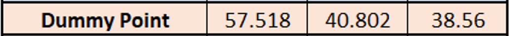

# Conversion Algorithm
This document describes the conversion algorithm that is used to convert gcode
commands into Fisnar commands.

## gcode
There are only a few gcode commands that are relevant to Fisnar printers. The
Fisnar is a direct ink writing printer, so it extrudes gel-like material through
a pressurized nozzle. Cura, however, is intended for FDM printers, so the gcode
it outputs includes commands for heating up nozzles and other junk that is
unnecessary for the purposes of this plugin. The only important gcode commands
and parameters are shown below.

### Commands
G0 ⟶ linear travel, conventionally with no extrusion

G1 ⟶ linear travel, conventionally with extrusion

G28 ⟶ travel to the home position

T<i> ⟶ change the active extruder to extruder 'i' (ie. T0 changes the active
extruder to extruder 0)

### Parameters
X<x> ⟶ set the x-position of a command to 'x' (ie. X10.73 sets the x-position
to 10.73 mm)

Y<y> ⟶ set the y-position of a command to 'y'

Z<z> ⟶ set the z-position of a command to 'z'

E<e> ⟶ extrude 'e' mm of filament. For the purposes of this plugin, it only matters
whether or not this command is 0 (if e = 0, then no dispensing should occur,
but if e > 0, then dispensing should occur)

F<f> ⟶ set the travel speed of the printhead to 'f' mm/min

## Fisnar command system
The Fisnar command system, when using multiple extruders, is relatively
straight forward. The Fisnar command system exists in a spreadsheet format
as opposed to a text-file format. There are really only 3 important commands:

### Dummy Point

yadda
