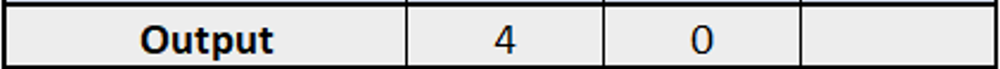

# Conversion Algorithm
This document describes the conversion algorithm that is used to convert gcode
commands into Fisnar commands.

## Gcode
There are only a few gcode commands that are relevant to Fisnar printers. The
Fisnar is a direct ink writing printer, so it extrudes gel-like material through
a pressurized nozzle. Cura, however, is intended for FDM printers, so the gcode
it outputs includes commands for heating up nozzles and other junk that is
unnecessary for the purposes of this plugin. The only important gcode commands
and parameters are shown below.

### Commands
G0 ⟶ linear travel, conventionally with no extrusion

G1 ⟶ linear travel, conventionally with extrusion

G28 ⟶ travel to the home position

T<t> ⟶ change the active extruder to extruder 't' (ie. T0 changes the active
extruder to extruder 0)

### Parameters
X<x> ⟶ set the x-position of a command to 'x' (ie. X10.73 sets the x-position
to 10.73 mm)

Y<y> ⟶ set the y-position of a command to 'y'

Z<z> ⟶ set the z-position of a command to 'z'

E<e> ⟶ extrude 'e' mm of filament. For the purposes of this plugin, it only matters
whether or not this command is 0 (if e = 0, then no dispensing should occur,
but if e > 0, then dispensing should occur)

F<f> ⟶ set the travel speed of the printhead to 'f' mm/min

## Fisnar command system
The Fisnar command system, when using multiple extruders, is relatively
straight forward. The Fisnar command system exists in a spreadsheet format
as opposed to a text-file format. There are really only 3 important commands:

### Dummy Point

The 'Dummy Point' command is followed by three parameters - the x, y, and z coordinates
(in that order) of the position to travel to. The printer will then travel from whatever
position it is currently at to the given coordinates in this command.

### Output

The 'Output' command is followed by two parameters: the output port, and then either
a 0 (off) or 1 (on). In this case, the command is telling the printer to turn
output 4 off.

Note: when the output is set to 1 (on), the pressure in the nozzle is set to
whatever the preset value on the dispenser is. When it is set to 0 (off), the pressure
in the nozzle is set to 0. This is purely an on/off process, and in using the
Smart Robot Edit software there is no way to set the nozzle to a pressure in
between the preset value and zero.

### Line Speed

The 'Line Speed' command sets the movement speed of the gantry system. The single
parameter is the speed to set, in mm/sec.

Note: the units for the Fisnar Line Speed command (mm/sec) are different
than the units for the gcode F parameter (mm/min)
