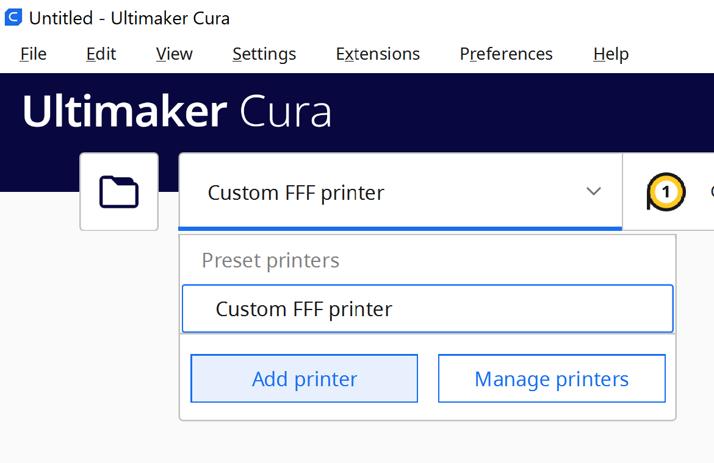
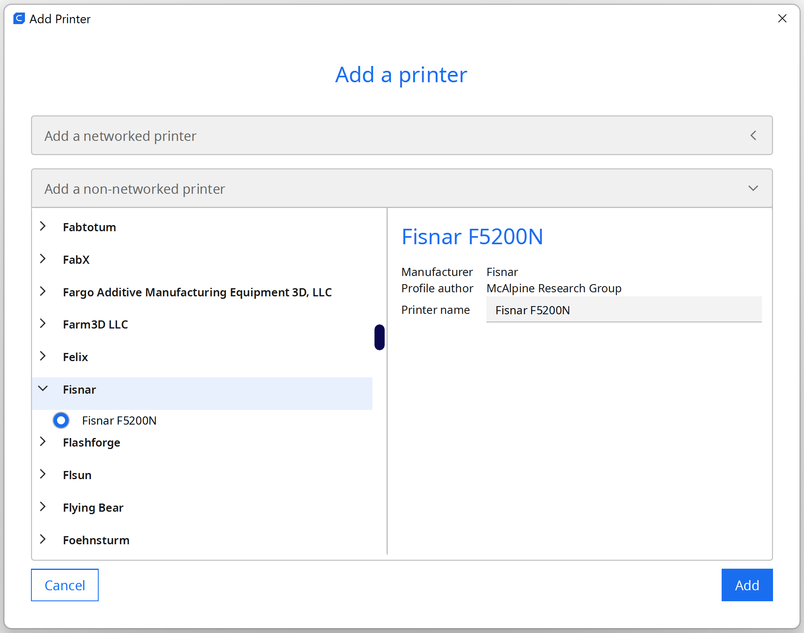
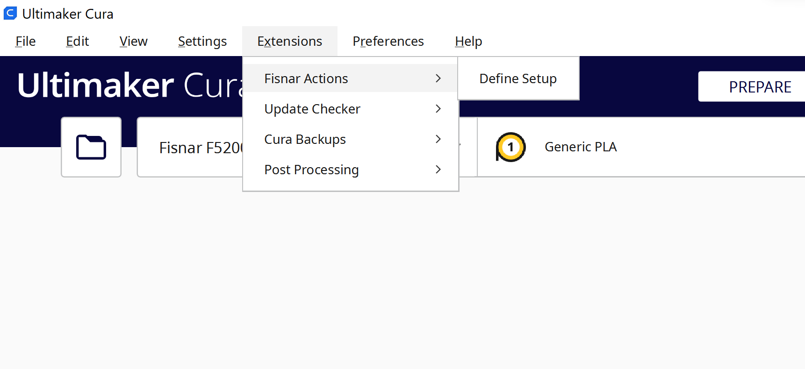
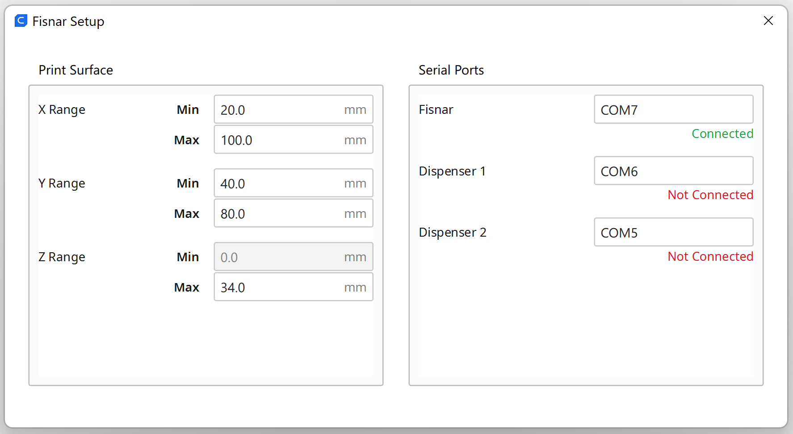
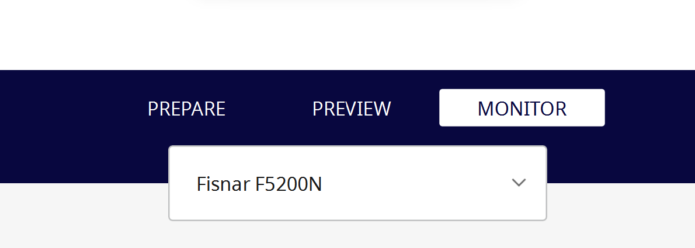
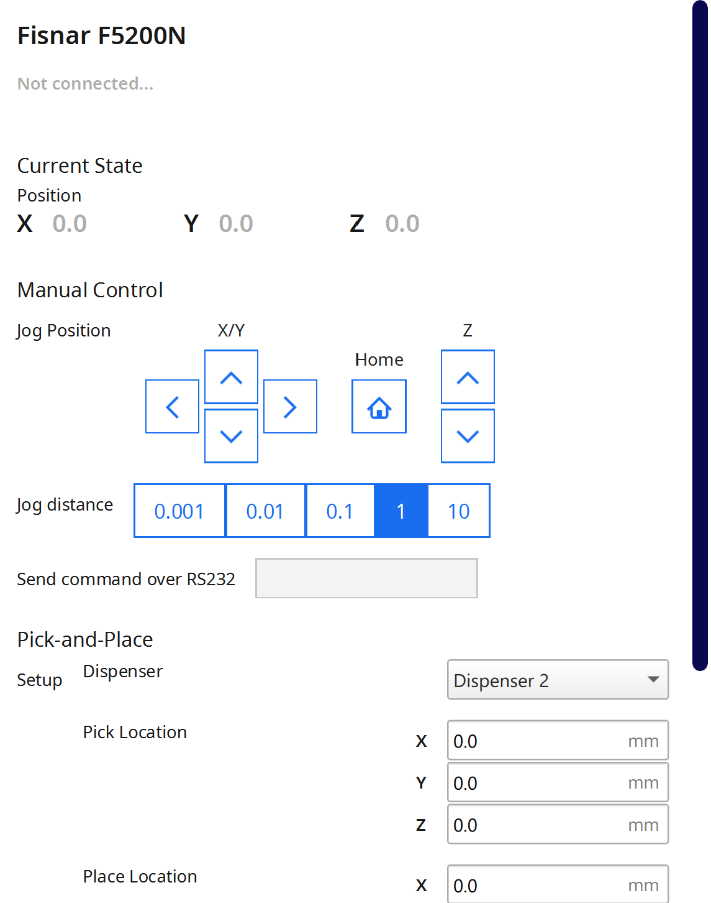
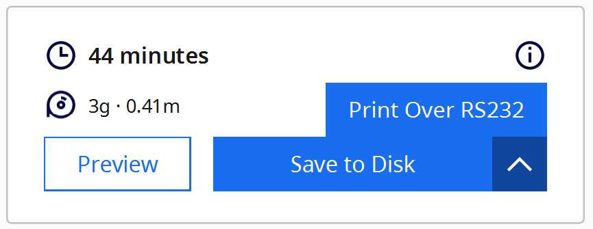

# FisnarRobotPlugin
Fisnar Robot Plugin adds the Fisnar F5200N dispensing robot to Cura,
allows slicer output to be saved in the Fisnar command .csv format, and
enables printing CAD models, executing pick-and-place maneuvers, and manually
controlling the robot over it's RS232 port.

# Table of Contents
- [Introduction](#introduction)
- [Installation and Initial Setup](#installation-and-initial-setup)
- [Necessary Physical Printer Configuration](#necessary-physical-printer-configuration)
- [Using the Plugin](#using-the-plugin)
- [Technical Details](#technical-details)
- [Contact](#contact)

## Introduction
FisnarRobotPlugin is a plugin for [Ultimaker Cura](https://ultimaker.com/software/ultimaker-cura) version 5.0.0+. Broadly speaking, it makes the Fisnar F5200N
robot compatible with Cura and adds some functionality to it. This plugin contains the necessary files to add
the Fisnar F5200N printer to Cura and enables exporting slicer output in the
Fisnar .csv format. Additionally, this plugin allows the user to print
with the Fisnar F5200N over the RS232 port, which eliminates any command limit
issues sometimes seen with Fisnar's proprietary command upload software ('Smart
Robot Edit'). There is also a user-interface that allows the user to 'jog' the
printer, manually type and send RS232 commands, and execute two-point pick-and-place
maneuvers.

A lot of this plugin was written using other existing plugins as guides. This
includes Ultimaker's [GCodeWriter](https://github.com/Ultimaker/Cura/tree/main/plugins/GCodeWriter) plugin and Tim Schoenmackers' [Dremel Printer](https://github.com/timmehtimmeh/Cura-Dremel-Printer-Plugin) plugin.

If you find any bugs/issues or have suggestions for this plugin, contact me
using the info below or use one of the GitHub communication features.

Lastly, the development of this plugin was funded by the [McAlpine Research Group](https://sites.google.com/view/mcalpineresearchgroup/home) at the University of Minnesota.

## Installation and Initial Setup

### Download Instructions
1. [Download and install Cura](https://ultimaker.com/software/ultimaker-cura) to your computer. The
plugin should function the same regardless of operating system.
2. As of now (8/15/2022), the plugin has been submitted to the [Ultimaker Marketplace](https://marketplace.ultimaker.com/app/cura/plugins)
and is under review. Until it is accepted, it can be installed by downloading the 'FisnarRobotPlugin-v8.1.0.curapackage'
file in the 'plugin_download' folder of this repo and dragging it onto an open Cura window. Once this
plugin is accepted to the Ultimaker Marketplace, it can be downloaded directly from there.

### Initial Setup
After installing the plugin, the Fisnar F5200N printer has to be added
before the plugin can be used. To do so, first navigate to the 'Add Printer' menu
as indicated in the picture below.

In the resulting menu, the Fisnar F5200N can be found under 'Add a non-networked
printer' > 'Fisnar' > 'Fisnar F5200N'.

## Necessary Physical Printer Configuration
This plugin assumes that (up to) two [Nordson Ultimus V](https://www.nordson.com/en/divisions/efd/products/fluid-dispensing-systems/ultimus-v-high-precision-dispenser)
dispensers are being used for pressure control. The only feature that does not
require these dispensers to be used is fisnar .csv file saving, which saves
in the format which uses 'Output <output> <on/off>' commands, and so requires a Fisnar [I/O Expansion Module](https://www.fisnar.com/products/robotics/robotic-accessories/robot-add-ons/) to be used with. Every other feature of the plugin, however, hinges upon the fact that the Ultimus V dispensers are being used.

## Using the Plugin
There are two main interfaces of the plugin: the 'Define Setup' window, and the
'Monitor' stage.

The define setup window can be accessed under the Extensions > Fisnar Actions
tab in the menu in the top left corner of the screen.

And the monitor stage can be accessed via the 'Monitor' tab in the top-middle of
the screen.

### Entering Setup Information
The define setup window has two main sections: 'Print Surface' and 'Serial
Ports'. The main purpose of this window is to enter information about the
physical setup being used.

#### Print Surface
The print surface info sets the x, y, and z boundaries for the print surface
in use. It should be noted that the Fisnar coordinate system is inverted to
the coordinate system used in Cura - the print surface coordinates should be
in the Fisnar coordinate system. This allows the Fisnar teach pendant to be used
to probe the surface and get the boundary values.

The 'z-maximum' entry is by far the most important - this defines the height of
the printing surface. Too low of a z-value means the print will start in mid-air,
and too high of a z-value means the nozzle will slam into the build surface (the +z axis points downward). The
'z-maximum' value is used to convert the Cura coordinate system to the Fisnar
coordinate system when exporting to Fisnar .csv.

The x and y boundary values are not used during the file export process, but
are useful for proper model placement in Cura. When x and y boundary values
are entered, the 'disallowed areas' in Cura are updated. This 'grays out'
the portions of the build plate in Cura that are outside of the print
surface, ensuring that models can only be sliced if they are within the
printable region.

#### Serial Ports
The serial ports section is used to assign the fisnar and dispensers to the
serial port they are connected to on the computer running Cura. Underneath
each text field, there is an indicator showing whether or not the device
is connected. Each device is set on a timer, such that every few seconds
the computer attempts to connect to them, so any changes in serial ports
may take a few seconds to update in the user interface.

### Saving Output to CSV
Once a model is loaded into Cura and positioned as intended, it can be sliced
by pressing the 'Slice' button in the bottom right corner of the screen.

After slicing, press the 'Save to disk' button that appears. This will open
up the file-saving interface. In the file-saving interface, the 'Fisnar Command CSV' format can be selected (if the machine being used is the Fisnar F5200N, this should be the default selection), which will save the slicer output in a Fisnar .csv file.

### Printing Over RS232 Port
After slicing, the slicer output can also be directly printed in real time.
In the same place as the 'Save to Disk' button, a dropdown arrow can be pressed
to activate a 'Print Over RS232' button.

Upon clicking this button, the monitor stage will be activated and the fisnar
will immediately begin printing. When the robot is printing, a progress bar near the bottom of the monitor stage will
indicate the percentage completion of the print, and buttons for
terminating, pausing, and resuming the print will appear.

### Manual Control
In the monitor stage, a user interface is provided for controlling the robot in real
time. There are jog buttons for the x, y, and z directions, as well as a home button.
The jog distance row beneath these buttons can be used to select how far the robot
will move (in mm) on each jog motion (button press). Under the jog distance row
is a text field, which can be used to send custom RS232 commands to the fisnar.
The format of these commands can be found under the [Fisnar RS232 Command Format](#fisnar-rs232-command-format) section of this document. The text in this box will be sent
to the robot upon pressing enter.

### Pick and Place
Underneath the manual control UI is an entry form for executing pick-and-place
maneuvers. Upon pressing the 'Execute Pick and Place' button, the entered parameters
will be used to generate and execute a series of commands which will pick an object up
at the 'pick' location and release it at the 'place' location.

## Technical Details
### Fisnar CSV Format
\< _coming soon_ \>

### Fisnar RS232 Command Format
\< _coming soon_ \>

## Contact
To report bugs/issues or make suggestions, email me at [spenbert02@gmail.com](mailto:spenbert02@gmail.com), or use one of the GitHub
communication features.
